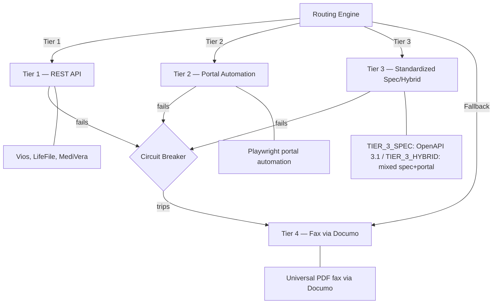

# CompoundIQ — System Architecture

## Overview

CompoundIQ is a multi-tenant compounding pharmacy order management platform built on Next.js 14 (App Router) and Supabase. It serves three user audiences through a single codebase using route groups.

> For POC setup instructions see [docs/poc-setup.md](poc-setup.md). For end-to-end validation guidance see [docs/poc-validation-log.md](poc-validation-log.md).

---

## Infrastructure Stack

| Component | Technology | Purpose |
|-----------|------------|---------|
| Hosting | Vercel (serverless + Edge) | Application runtime, cron jobs, preview deployments |
| Database | Supabase (PostgreSQL 15) | Persistent data, RLS, Auth, Vault, Storage |
| Authentication | Supabase Auth | JWT-based, role claims in `user_metadata.app_role` |
| Secrets | Supabase Vault | Pharmacy credentials encrypted at rest (AES-256-GCM) |
| Storage | Supabase Storage | Prescription PDFs, adapter screenshots |
| Payments | Stripe Connect Express | Multi-clinic disbursements |
| SMS | Twilio Programmable Messaging | Patient payment links, status updates |
| Fax | Documo mFax API v2 | Tier 4 fax fallback, inbound fax triage |
| Monitoring | Sentry | Error tracking with mandatory PHI scrubbing |
| Ops Alerting | Slack (#ops-alerts, #deployments) | SLA breach alerts, DLQ notifications |
| Critical Escalation | PagerDuty Events API v2 | Tier 3 SLA escalations, on-call paging |
| CI/CD | GitHub Actions + Vercel CLI | Automated test, migrate, deploy pipeline |

---

## Three-Application Architecture

```
compoundiq/
  src/app/
    (clinic-app)/       → Clinic staff (MAs, providers, admins)
    (ops-dashboard)/    → Internal ops team
    (patient-checkout)/ → Patients (unauthenticated, token-gated)
    api/                → Shared API routes (webhooks, crons, health)
```

### Clinic App `/(clinic-app)/`
- Medical assistants build prescriptions, select pharmacies, set pricing
- Providers sign orders digitally (canvas-based signature)
- Clinic admins manage team and Stripe Connect onboarding
- Multi-tenant: each clinic sees only its own orders, patients, and providers (RLS)

### Ops Dashboard `/(ops-dashboard)/`
- Cross-clinic order pipeline view (ops_admin role bypasses clinic-scoped RLS)
- SLA heatmap, DLQ monitor, adapter health status
- Fax triage queue for inbound fax matching
- Catalog upload tool for pharmacy pricing updates

### Patient Checkout `/(patient-checkout)/`
- Stateless — no login required
- Token-gated via 72-hour JWT checkout token
- Mobile-optimized (375px viewport target)
- Stripe Elements for card capture

### Public Routes (No Session Required)

The following routes are excluded from session enforcement in `src/middleware.ts`:

| Route | Reason |
|-------|--------|
| `/login` | Auth entry point |
| `/unauthorized` | Renders without a valid session |
| `/auth/callback` | PKCE code exchange — arrives as cold visit from email link |
| `/api/webhooks/*` | External webhook senders have no Supabase session |
| `/api/cron/*` | Vercel cron triggers authenticate via `CRON_SECRET` bearer token |
| `/api/health` | CI/CD health check — no session in deploy pipeline |
| `/checkout/*` | Patient checkout — token-gated at Edge Middleware, not session-gated |

### Health Check

`GET /api/health` — Returns `{"status":"ok","db":"ok","version":"<git-sha>"}`. Called by the CI/CD pipeline after every deployment to verify the database connection is live. This route is public (no auth required).

---

## Data Flow

```
1. MA builds prescription → selects pharmacy (state-compliance search)
2. Provider signs order → DRAFT → AWAITING_PAYMENT (snapshot locked)
3. SMS payment link sent via Twilio → patient opens checkout
4. Patient pays → Stripe payment_intent.succeeded webhook
5. Order → PAID_PROCESSING → routing engine selects adapter tier
6. Adapter submits to pharmacy (Tier 1/2/3 or Tier 4 fax)
7. Pharmacy acknowledges → webhooks / portal polling / inbound fax
8. Status flows: PHARMACY_ACKNOWLEDGED → COMPOUNDING → SHIPPED → DELIVERED
9. SLA engine monitors each transition, fires Slack/PagerDuty on breach
```

---

## V2.0 Pharmacy Adapter Tier Architecture



### Tier Selection Logic

1. **Tier 1** (direct API): Real-time confirmation, lowest latency. Used if `integration_tier = TIER_1_API` and circuit breaker is CLOSED.
2. **Tier 2** (portal automation): Playwright submits via pharmacy web portal. Used if `integration_tier = TIER_2_PORTAL`.
3. **Tier 3** (standardized spec): OpenAPI-based registration + webhook callbacks. Used if `integration_tier = TIER_3_SPEC` or `TIER_3_HYBRID`.
4. **Tier 4** (fax fallback): Universal fallback for all pharmacies. Always available.

### Circuit Breaker States

`CLOSED` → (threshold failures) → `OPEN` → (cooldown 5 min) → `HALF_OPEN` → (probe succeeds) → `CLOSED`
`HALF_OPEN` → (probe fails) → `OPEN` (cooldown resets)

---

## Webhook Processing Pipeline

All inbound webhooks follow a 7-step pattern:

```
1. Verify signature (HMAC-SHA256 or Stripe SDK)
2. Parse and validate payload schema (Zod)
3. Check external_event_id for idempotency (reject duplicates)
4. Insert into webhook_events or pharmacy_webhook_events
5. Resolve associated order
6. Execute business logic (status transition via casTransition())
7. Mark webhook processed_at
```

---

## SLA Engine

8 SLA types (matching `sla_type_enum`) track the order lifecycle:

| SLA Type | Window | Trigger | Breach Action |
|----------|--------|---------|---------------|
| PAYMENT_SUBMISSION | 24h | AWAITING_PAYMENT | SMS reminder |
| ADAPTER_SUBMISSION_ACK | 15–30 min | SUBMISSION_PENDING | Cascade to Tier 4 |
| PHARMACY_ACKNOWLEDGE | 4h | PAID_PROCESSING | Slack Tier 1 alert |
| PHARMACY_CONFIRMATION | 8h | PHARMACY_ACKNOWLEDGED | Slack Tier 2 alert |
| PHARMACY_COMPOUNDING_ACK | 2h biz | PHARMACY_ACKNOWLEDGED | Slack alert |
| PHARMACY_COMPOUNDING | 24h biz | PHARMACY_COMPOUNDING | Escalate |
| SHIPPING | 48h biz | PHARMACY_CONFIRMED | PagerDuty Tier 3 |
| DELIVERY | 10 biz days | SHIPPED | Ops notification |

Breach escalation tiers: Tier 1 = Slack #ops-alerts → Tier 2 = Slack DM to on-call → Tier 3 = PagerDuty critical incident.

---

## Security Architecture

### RLS Multi-Tenant Isolation

```
clinic_user JWT → clinic_id claim → RLS filters all queries
ops_admin JWT  → app_role claim  → cross-clinic SELECT access
service_role   → bypasses RLS    → webhook handlers, cron jobs
```

### Vault Credential Flow

```
Pharmacy API key stored → vault.create_secret() → returns vault_secret_id (UUID)
UUID stored in pharmacy_api_configs.vault_secret_id
At runtime: vault.decrypted_secret(vault_secret_id) → plaintext key (server-side only)
```

### PHI Boundaries

| Service | PHI Permitted |
|---------|--------------|
| Supabase | Yes (encrypted at rest, RLS-protected) |
| Stripe | No (use order_id only) |
| Sentry | No (phi-scrubber mandatory in beforeSend) |
| Slack | No (order_id + status codes only) |
| PagerDuty | No (order_id + SLA metadata only) |
| Twilio | Phone number only (not stored in logs) |

---

## Deployment Architecture

```
GitHub (main branch)
    → GitHub Actions CI (lint + typecheck + test + build)
    → Supabase CLI: supabase db push (migrate)
    → Vercel CLI: vercel deploy --prebuilt (deploy)
    → Health check: GET /api/health
    → Slack #deployments notification

GitHub (develop branch) → staging environment (same flow)
PRs → Vercel preview deployments (no migration, no Slack)

Rollback:
    → GitHub Actions: Rollback workflow (manual trigger)
    → vercel promote (restore previous deployment)
    → supabase db execute (run down migration if needed)
```

---

## Cron Jobs

| Route | Schedule | Purpose |
|-------|----------|---------|
| `/api/cron/sla-check` | Every 5 min | Scan SLA breaches, fire Slack/PagerDuty |
| `/api/cron/submission-reconciliation` | Every 30 min | Flush ops_alert_queue to Slack, check orphaned submissions |
| `/api/cron/fax-retry` | Every 5 min | Retry FAX_QUEUED orders at 5/15 min intervals |
| `/api/cron/daily-digest` | Daily 8am ET | Send ops digest to Slack |
| `/api/cron/portal-status-poll` | Every 15 min | Poll Tier 2 portal for order status updates |
| `/api/cron/screenshot-cleanup` | Hourly | Delete objects from `adapter-screenshots` bucket older than 72h |
